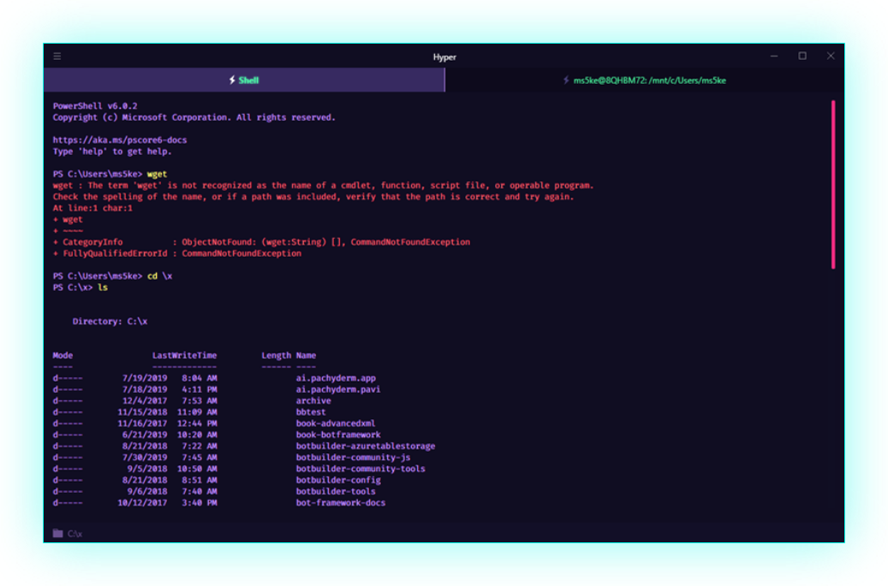
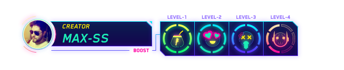
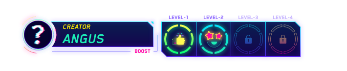
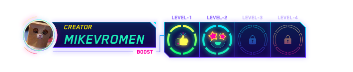
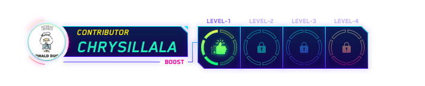

<h1>A crazy Cyberpunk theme for Visual Studio Code.</h1>

<h1>That's it! Activate now the UMBRA protocol.</h1>

<h1>👾 That's it! Activate now the SCARLET protocol 👾 (BETA).</h1>

I know, it may look like a rainbow and even give the sensation of distraction.
But fundamentally I chose the cyberpunk theme, because it allows me to use a very wide color palette, this helps each fragment of code to have practically a color, so our eye quickly detects color changes and our brain is processing and memorizing the information received. This can help unconsciously improve your productivity when programming, as we recognize quickly, for example: if it is an object, a class, a method, etc...

 
 

### Cyberpunk Chrome theme by [Angus J. Pope](https://github.com/angusPope)

### Cyberpunk iTerm by [Murderlon](https://github.com/Murderlon/cyberpunk-iterm)

### Cyberpunk Hyper by [szul](https://github.com/szul)

### Cyberpunk SCARLET for Windows Termin [hasparus](https://gist.github.com/hasparus)

### CyberPunk2077-umbra-WindowsTerminal [mikevromen](hhttps://github.com/mikevromen)

 
 

[More information about boost](/wiki/boost.md)

 
 

- You are freelance, you have a team or in your company use Slack?, keep everything in tune with cyberpunk.
Copy and paste these colors to customize your Slack.
`#372963,#100D23,#100d23,#00FF9C,#100D23,#c592ff,#00FF9C,#ff4081`

- Recommended font [FiraCode](https://github.com/tonsky/FiraCode)
- Recommended `"editor.fontLigatures": true,`
- Recommended `"editor.lineHeight": 30,`
- Recommended [Rainbow Brackets](https://marketplace.visualstudio.com/items?itemName=2gua.rainbow-brackets). This plugin complements to the perfection the cyberpunk theme

 
 

Your feedback are most welcome.
So you're invited to stop by the section [Rating & Review](https://marketplace.visualstudio.com/items?itemName=max-SS.cyberpunk#review-details)
Remember that this theme is for you so let's build it together.

Don't forget to rate

 
 
 
 
 
 
 

