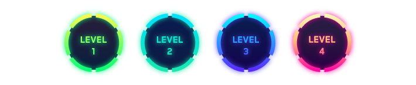
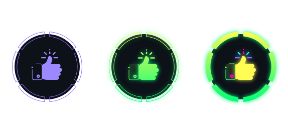

# Boost (Increases)

In addition to earning a reputation for your work, you get raises for being creative, professional and an awesome member of the community. These raises are my way of thanking you for your interest in continuing to expand this theme that I started in 2017. And on the other hand I hope others will be motivated to participate in the co-creation of Cyberpunk.

## Levels of Boost
There are four levels of rarity and difficulty. These can be identified by their different colours.

---

### Friendly

This is the most basic and easy to get increase, you just need to do 1 PR of at least 4 lines or several PRs of at least 1 line, until you get the 5 experience bars.

---

### Culture (COMING SOON)

---

### Super STAR

This increase is achieved by creating a theme based on Cyberpunk. For example: for a terminal, messaging service like slack, operating system theme like windows, for a browser, etc.

Another way to get this boost: Once the Friendly badge is completed, every PR done to Cyberpunk will grant an experience bar, until the badge is completed.

---

### Lovely

This boost is achieved in its full form by creating a new protocol using Cyberpunk as a baseline, for example UMBRA protocol, or SCARLET protocol.

Another way to get this boost: Once you have completed the Fiendly badge, each PR done to a protocol grants one experience bar, until the badge is completed.

---

### Monster

This boost is one of the most difficult to achieve, but not impossible. It is achieved in its full form by porting Cyberpunk to another IDE such as Atom, SublimeText or PHPStorm from the PROMETHEUX repositories.

Another way to get this boost: You must have in its full form at least 2 of the previous boost and for each PR of at least 20 lines you will get an experience bar, until you complete the badge.

---

### Robo-CAT

This boost is one of the most difficult to achieve, but not impossible. It is achieved in its full form by creating an automation or configuration script for Cyberpunk and its protocols.

Another way to get this boost: You must have at least 2 of the above boost in full form and for every PR of at least 10 lines to an automation or configuration script you will get an experience bar, until you complete the boost.

 
 
 
 
 
 
 

